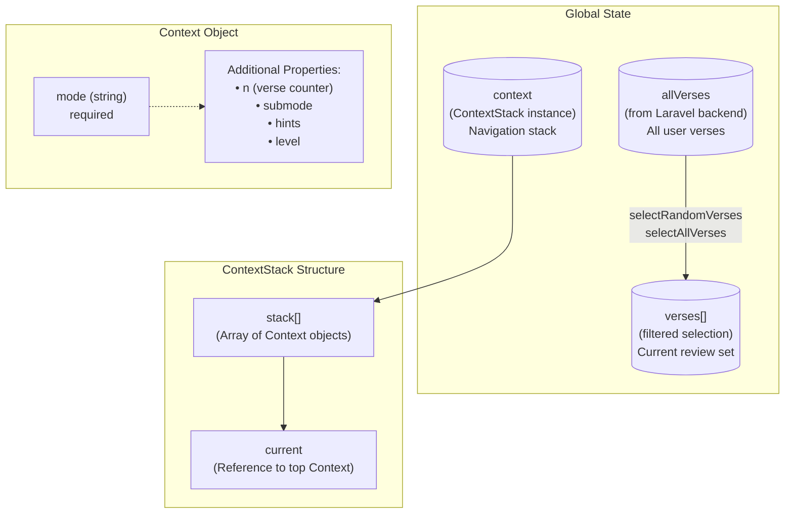
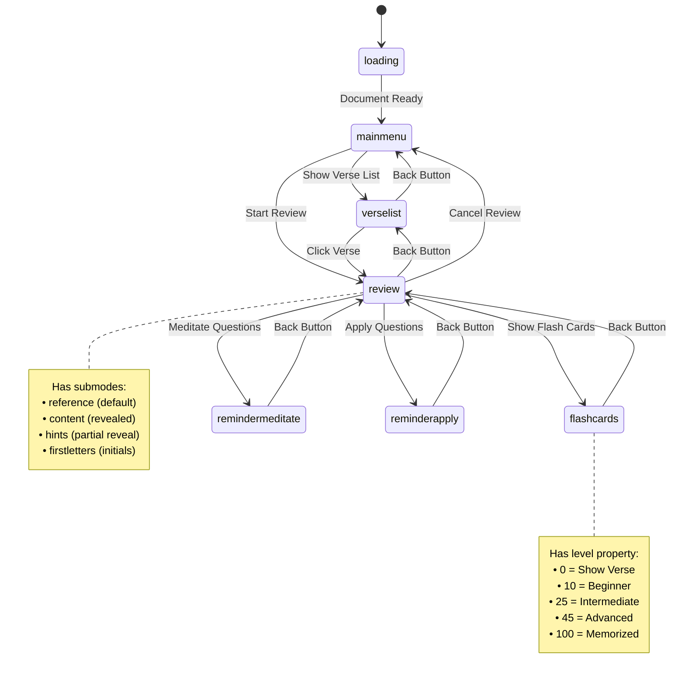
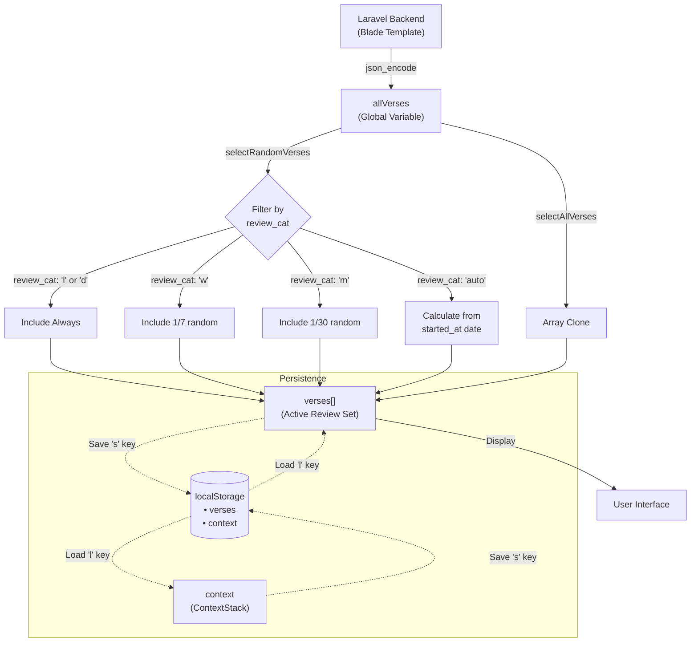
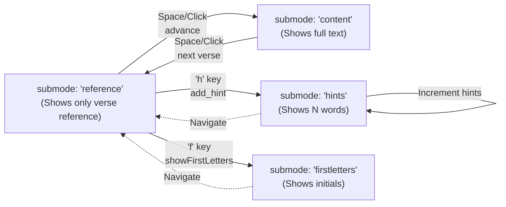
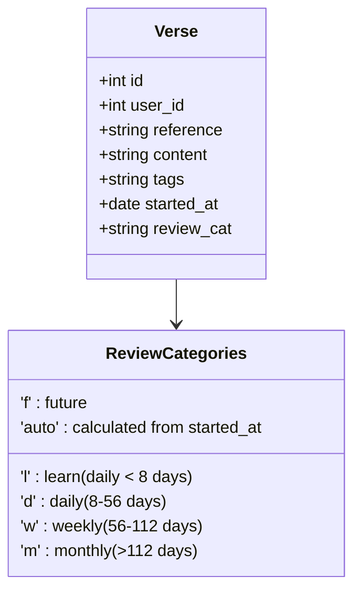
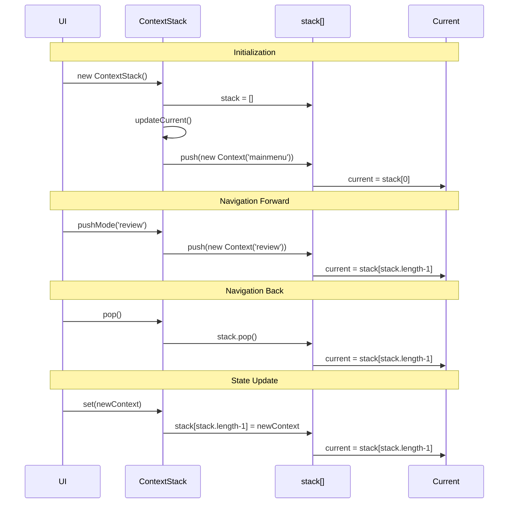
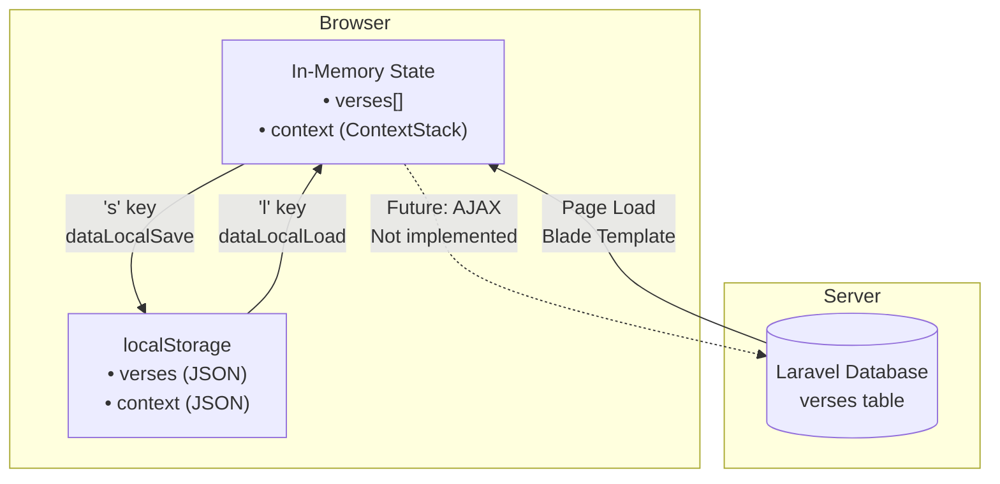
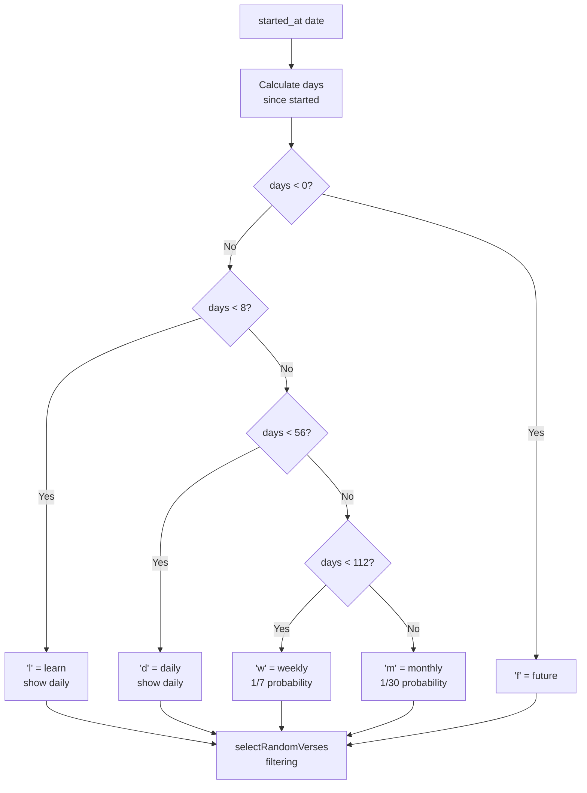
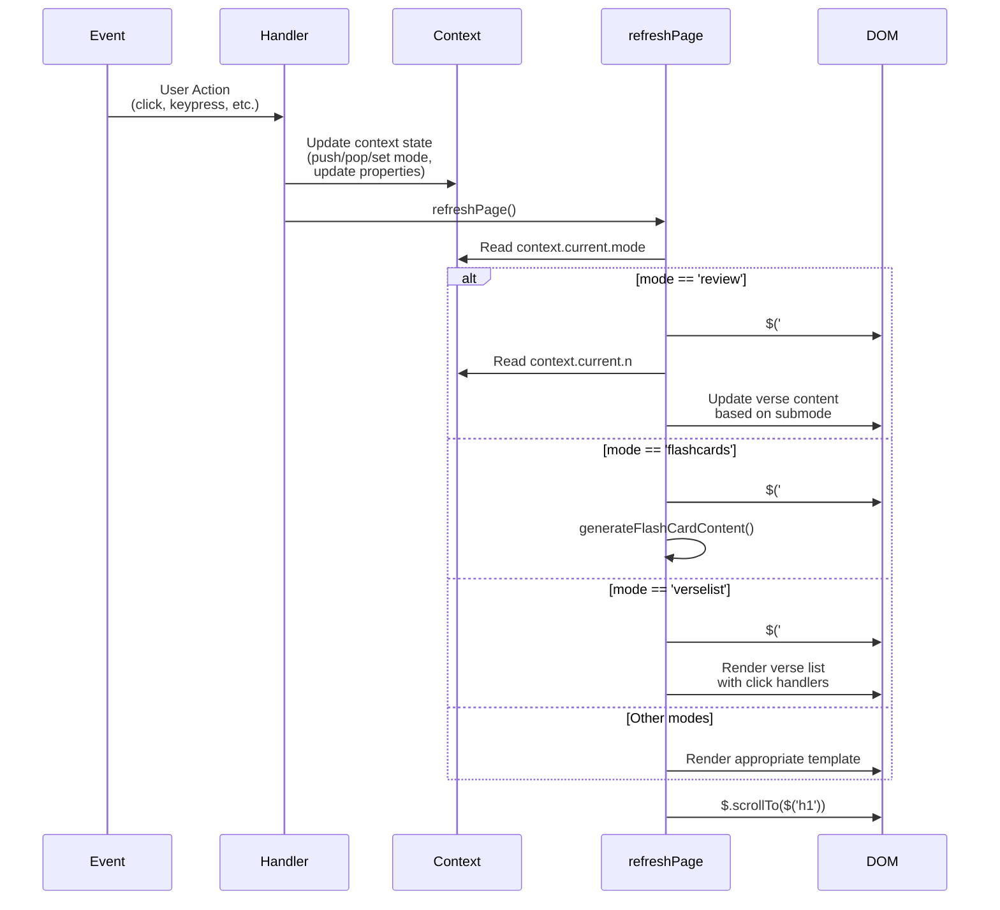

# Bible Memory App - State Architecture Diagram

## Overview
The Bible Memory application uses a custom stack-based state management system built with jQuery.

---

## State Architecture



---

## Application Modes (State Machine)



---

## Context State Properties by Mode

```mermaid
graph LR
    subgraph loading
        L1[mode: 'loading']
    end

    subgraph mainmenu
        M1[mode: 'mainmenu']
    end

    subgraph verselist
        VL1[mode: 'verselist']
    end

    subgraph review
        R1[mode: 'review']
        R2[n: verse number 1-indexed]
        R3[submode: 'reference' | 'content' | 'hints' | 'firstletters']
        R4[hints: number optional]
        R1 --> R2
        R1 --> R3
        R1 --> R4
    end

    subgraph flashcards
        F1[mode: 'flashcards']
        F2[n: verse number]
        F3[level: 0-100]
        F1 --> F2
        F1 --> F3
    end

    subgraph remindermeditate
        RM1[mode: 'remindermeditate']
    end

    subgraph reminderapply
        RA1[mode: 'reminderapply']
    end
```

---

## Data Flow Architecture



---

## Review Submodes Flow



---

## Verse Object Schema



---

## ContextStack Operations



---

## Keyboard Shortcuts & State Changes

| Key | Action | Context Mode | State Change |
|-----|--------|--------------|--------------|
| `n` | Next verse | review | `context.current.n++`, `submode = 'reference'` |
| `Space` | Advance/Reveal | review | `submode = 'content'` or next verse |
| `p` | Previous verse | review | `context.current.n--`, `submode = 'reference'` |
| `h` | Show hints | review | `submode = 'hints'`, `hints += 1` |
| `f` | First letters | review | `submode = 'firstletters'` |
| `s` | Save locally | any | `localStorage.verses/context = ...` |
| `l` | Load locally | any | `verses/context = localStorage...` |

---

## State Persistence Strategy



---

## Auto Review Frequency Calculation



---

## Component Rendering Flow



---

## Summary

### Key State Management Principles

1. **Stack-Based Navigation**: The app uses a `ContextStack` with push/pop operations for modal-like navigation
2. **Mode-Driven UI**: Each Context has a `mode` that determines which template/screen to render
3. **Immutable Context Updates**: Each state change creates or replaces Context objects rather than mutating
4. **Local Persistence**: State can be saved/loaded from localStorage for offline functionality
5. **Server Initialization**: Initial verse data comes from Laravel backend via Blade template

### State Flow Pattern

```
User Action → Update Context → refreshPage() → Read Context → Render DOM
```

### Technologies

- **State Management**: Custom JavaScript classes (Context, ContextStack)
- **Persistence**: Browser localStorage + Laravel backend
- **Rendering**: jQuery DOM manipulation with template cloning
- **Navigation**: Stack-based with push/pop operations
